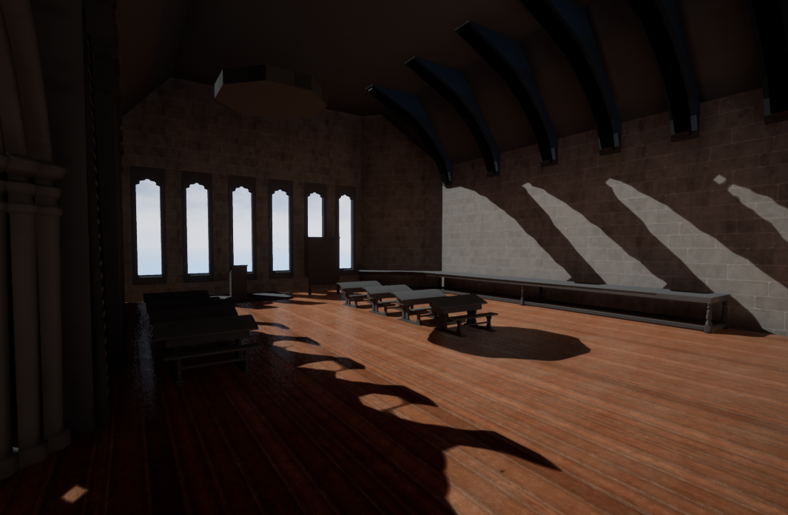

# BalthairUniversity

Developed with Unreal Engine V. 4.22.3 

Current status of level:
 

I have used Substance designer to create:</li>
<ul>
  <li>the floor planks</li>
  <li>the cobble stone wall</li>
</ul>

I am using Maya to create the interior and work iteratively between UE4 and Maya in regards of look and feel and scaling of objects in the scene.
